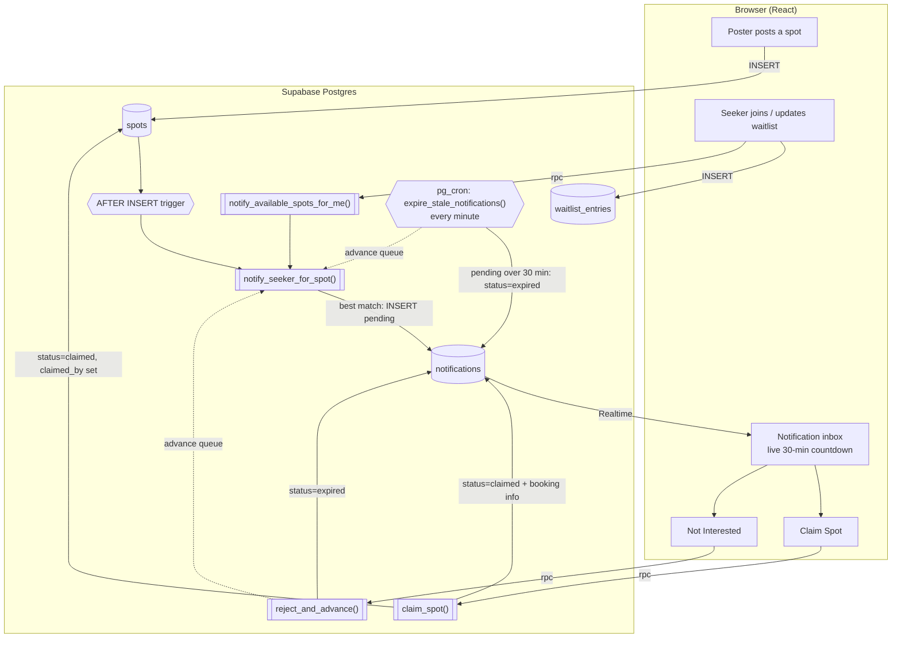
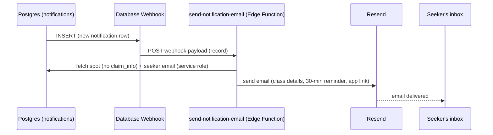
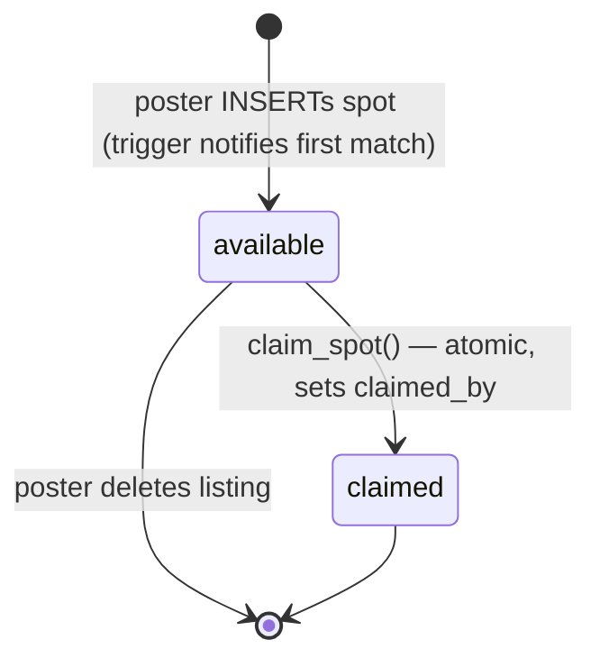
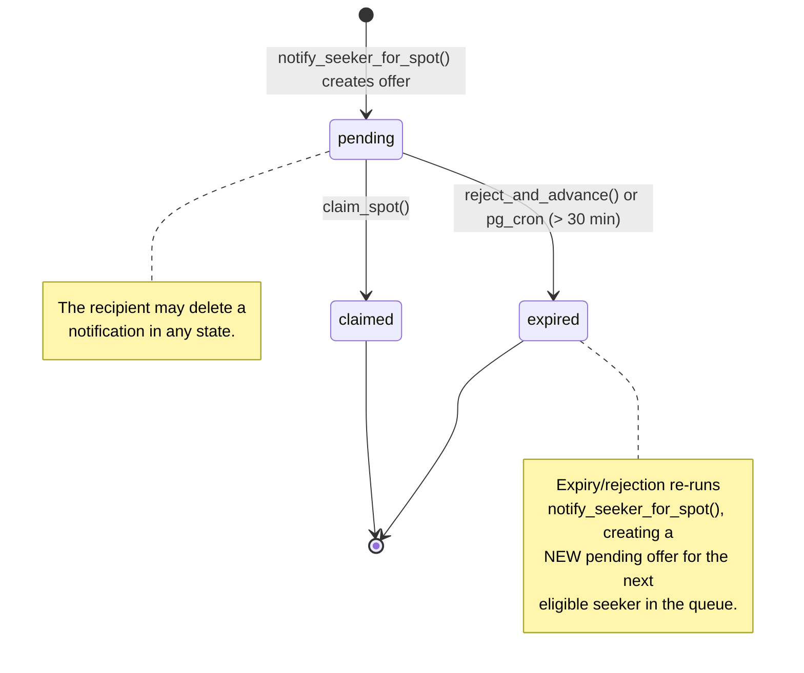

# No Show

A peer-to-peer fitness spot exchange. If you can't make a class you signed up for, post your spot so someone else can take it and avoid the cancellation fee. Seekers join a waitlist with their preferences and get notified the moment a matching spot is posted.

---

## Features

**Spot Posting**
- Post a class spot with studio name, class name, address, date, time, class type, level, and instructor
- Booking name is auto-filled from your profile
- Add additional booking info (door codes, check-in notes) that is only revealed after someone claims the spot
- Delete a listing anytime before it's claimed
- Spots must be posted at least 1 hour before the class start time

**Waitlist**
- Join the waitlist by selecting preferred class types, class level, and time of day (morning, afternoon, evening)
- Matching engine finds the best fit from the waitlist when a spot is posted
- Preferences can be updated at any time

**Smart Matching & Queue**
- When a spot is posted, the system matches against waitlist preferences (class type, level, and time of day)
- Falls back to class-type-only matching if no exact match is found
- If a seeker doesn't claim within 30 minutes, the spot automatically moves to the next person in line
- Seekers can also click "Not Interested" to pass and advance the queue
- After claiming a spot, the seeker is moved to the back of the waitlist so others get priority

**Notifications**
- Real-time in-app notification inbox
- Each notification includes a live 30-minute countdown timer
- Booking info (name, door code, etc.) is revealed only after claiming
- Notifications can be individually deleted or cleared all at once
- Notification badge on the navbar updates in real time and clears when inbox is visited

**Dashboard**
- Overview of upcoming claimed classes and active listings side by side
- Past classes split into classes taken and classes listed
- All spot details displayed: studio, class name, date, location, level, instructor, type

**Account**
- View and edit profile information
- Sign out

---

## Tech Stack

| Layer | Technology |
|---|---|
| Frontend | React + TypeScript (Vite) |
| Backend / Database | Supabase (Postgres + Auth) |
| Real-time | Supabase Realtime (postgres_changes) |
| Server-side logic | Postgres functions + triggers (`SECURITY DEFINER`) |
| Scheduled jobs | pg_cron (notification expiry, every minute) |
| Email | Supabase Edge Function (Deno) + Resend, via a Database Webhook |
| Routing | React Router v6 |
| Fonts | Berkshire Swash, Afacad (Google Fonts) |

---

## Getting Started

### Prerequisites
- Node.js 18+
- A [Supabase](https://supabase.com) project

### Installation

```bash
git clone https://github.com/your-username/no-show.git
cd no-show
npm install
```

### Environment Variables

Create a `.env` file in the project root:

```
VITE_SUPABASE_URL=https://your-project.supabase.co
VITE_SUPABASE_ANON_KEY=your-anon-key
```

Both values are found in your Supabase project under **Settings → API**.

### Database Setup

The entire database lives in a single self-contained [`schema.sql`](schema.sql) — tables, indexes, RLS policies, functions, triggers, extensions, and the `pg_cron` job.

1. **(Privileged extensions first)** In **Database → Extensions**, enable **`pg_cron`** and **`pg_net`**. These require `shared_preload_libraries` and can't always be created from plain SQL on a fresh project, so toggle them in the dashboard first. (`cube`, `earthdistance`, `pgcrypto` are created by `schema.sql` itself.)
2. **Run the schema.** Paste all of [`schema.sql`](schema.sql) into the **SQL Editor** and run it, top to bottom. It's idempotent, so it's safe to re-run.
3. **Set the edge function secrets** (used by the Supabase Edge Functions, not the DB). See [`docs/EMAIL_SETUP.md`](docs/EMAIL_SETUP.md) for the email flow; the full set:
   ```bash
   npx supabase secrets set \
     ANTHROPIC_API_KEY=sk-ant-xxxx \
     RESEND_API_KEY=re_xxxx \
     APP_URL="https://your-app-url" \
     GEOCODER_USER_AGENT="no-show/1.0 (contact: you@example.com)"
   # optional: RESEND_FROM="No Show <notify@yourdomain.com>"
   ```
   Then deploy the functions: `npx supabase functions deploy --use-api`.

> **Regenerating from a live DB:** `npx supabase db dump --schema public -f schema.sql` re-captures tables/columns/RLS/functions/triggers, but a plain dump **omits** the `EXTENSIONS` block (top) and the `PG_CRON SCHEDULE` block (bottom). Both are clearly bannered in `schema.sql` — re-add them after any re-dump so the file stays self-contained.

### Run Locally

```bash
npm run dev
```

### Testing

Unit tests (Vitest) cover the matching decision logic:

```bash
npm test          # run once
npm run test:watch
```

---

## Project Structure

```
schema.sql                      # full database DDL (tables, RLS, triggers, functions)
src/
├── lib/
│   ├── supabase.ts
│   ├── matching.ts             # pure reference impl of the SQL matcher (for tests only)
│   └── matching.test.ts        # Vitest unit tests for the matching decision
├── types/
│   └── index.ts
├── components/
│   ├── Layout/Navbar.tsx
│   ├── Spots/PostSpotForm.tsx
│   ├── Waitlist/WaitlistForm.tsx
│   └── Waitlist/NotificationInbox.tsx
└── pages/
    ├── LandingPage.tsx
    ├── LandingPage.css
    ├── LoginPage.tsx
    ├── SignupPage.tsx
    ├── Dashboard.tsx
    └── AccountPage.tsx
```

> **Note:** `src/lib/matching.ts` is **not** used at runtime — the app matches server-side in Postgres. It's a pure, dependency-free re-expression of `notify_seeker_for_spot()` kept only as an executable spec for the unit tests (`npm test`).

---

## How It Works

1. A user signs up for a fitness class but later can't make it
2. They post their spot on No Show with the class details and any booking info needed to attend
3. Posting the spot fires a Postgres `AFTER INSERT` trigger that scans the waitlist **server-side** for the best match (class type, level, and time of day, falling back to class-type-only) and inserts a notification for the matched seeker
4. The matched seeker receives a real-time notification with a 30-minute countdown to claim the spot
5. If they claim it, an atomic `claim_spot()` function marks the spot claimed and returns the full booking info — only one seeker can win the claim, even under a simultaneous race
6. If they click "Not Interested" (`reject_and_advance()`) or the 30-minute window lapses (a `pg_cron` job), the offer is expired and the spot is passed to the next eligible seeker automatically

## Architecture

All matching, notification creation, claiming, and expiry run **inside the database** as `SECURITY DEFINER` Postgres functions — never in the browser. This keeps the queue tamper-proof (the client can't fabricate notifications or force-claim a spot) and lets Row Level Security stay locked down to least privilege. The React app only performs owner-scoped reads/writes and calls the functions via `supabase.rpc(...)`.

### Server-side functions

| Function | Type | Purpose |
|---|---|---|
| `handle_new_user()` | trigger on `auth.users` | Creates a `profiles` row on signup |
| `spot_time_of_day(ts)` | helper | Buckets a class time into morning / afternoon / evening |
| `notify_seeker_for_spot(spot_id)` | `SECURITY DEFINER` | Core matcher: finds the next eligible seeker (exact → fallback, FIFO, skipping anyone already offered the spot) and inserts one pending notification |
| `spots_notify_on_insert()` | `AFTER INSERT` trigger on `spots` | Runs the matcher when a spot is posted |
| `notify_available_spots_for_me()` | `SECURITY DEFINER` RPC | When a seeker joins/updates the waitlist, matches already-available spots |
| `claim_spot(spot, notif, entry)` | `SECURITY DEFINER` RPC | Atomically claims a spot (only if still available), marks the notification claimed, bumps the seeker to the back of the queue, and returns booking info |
| `reject_and_advance(notif)` | `SECURITY DEFINER` RPC | "Not Interested": expires the offer and advances the queue |
| `expire_stale_notifications()` | `pg_cron`, every minute | Expires pending offers older than 30 minutes and advances the queue |

The client-side 30-minute countdown is now **purely a display**; the authoritative expiry is the `pg_cron` job.

### Data flow: post → match → notify → claim / expire



### Email notifications

Whenever a notification row is created, the matched seeker also gets an email. This runs entirely server-side and is decoupled from matching:

1. A **Supabase Database Webhook** fires on every `INSERT` into `notifications`.
2. The webhook calls the **`send-notification-email` Edge Function** ([`supabase/functions/send-notification-email/`](supabase/functions/send-notification-email/)) with the standard webhook payload (the new row under `record`).
3. The function uses the **service role key** to look up the spot (`spot_id`) and the seeker's email (`auth.admin.getUserById(seeker_id)`).
4. It sends the email via the **Resend API** — subject like *"A spot just opened: {class name} at {studio}"*, with the class details, studio/location, date/time, and a 30-minute claim reminder plus a link back to the app (`APP_URL`).



**Booking secrets are never emailed.** The function explicitly selects only non-secret spot fields and never reads `claim_info` — door codes and check-in details are revealed only in the app after the seeker claims the spot. Email is also **best-effort**: any failure (missing email, Resend error) is logged and the function still returns `200`, so a bad email can never block matching or cause the webhook to retry forever.

Setup steps (secrets + creating the webhook) are in [`docs/EMAIL_SETUP.md`](docs/EMAIL_SETUP.md).

## Database Schema

No Show uses four tables in Supabase Postgres. Row Level Security (RLS) is enabled on all tables and locked down to **least privilege**: the client may only read/write its own rows. Every cross-user write (creating a notification for someone else, claiming a spot, advancing the queue) goes through a `SECURITY DEFINER` function that bypasses RLS in a controlled way — so the permissive policies the browser used to need have been removed.

The full, self-contained DDL — tables, RLS, functions, triggers, extensions, and the `pg_cron` job — lives in [`schema.sql`](schema.sql).

---

### `profiles`

Stores basic user information. A row is automatically created via a Postgres trigger (`handle_new_user`) when a new user signs up through Supabase Auth.

| Column | Type | Notes |
|---|---|---|
| id | uuid | References `auth.users` |
| full_name | text | Set at signup |
| created_at | timestamptz | Auto-set |

**Policies**

- **Readable by all authenticated users** — The matching engine needs to read any user's profile to auto-fill the booking name when a spot is posted. Without this, the form couldn't fetch the poster's name.
- **Editable by owner only** — A user can only update their own profile row, preventing anyone from modifying another user's name or details.

---

### `spots`

Stores every class spot that has been posted. Each spot belongs to the user who posted it.

| Column | Type | Notes |
|---|---|---|
| id | uuid | Primary key |
| poster_id | uuid | References `profiles` |
| title | text | Class name (e.g. Morning Flow) |
| class_type | text | e.g. Yoga, Spin |
| studio | text | Studio name |
| location | text | Studio address |
| scheduled_at | timestamptz | Class date and time |
| class_level | text | Optional |
| instructor | text | Optional |
| claim_info | text | Revealed only after claiming |
| status | text | `available` or `claimed` (check constraint) |
| claimed_by | uuid | Seeker who claimed the spot (references `profiles`) |
| created_at | timestamptz | Auto-set |

A check constraint enforces that a spot is posted **at least 1 hour before** `scheduled_at` (`scheduled_at >= created_at + interval '1 hour'`).

**Policies**

- **Readable by all authenticated users** — Any logged-in user needs to be able to see available spots.
- **Insertable by owner only** — A user can post a spot, but only as themselves (`auth.uid() = poster_id`).
- **No direct UPDATE policy** — Claiming is the only update a spot receives, and it happens exclusively through the `claim_spot()` function. There is no client-facing UPDATE policy, so the browser cannot flip a spot's status directly.
- **Deletable by owner only** — Only the user who posted the spot can delete it.

---

### `waitlist_entries`

Stores each user's waitlist preferences. A user can have one active entry specifying the class types, level, and time of day they are looking for.

| Column | Type | Notes |
|---|---|---|
| id | uuid | Primary key |
| seeker_id | uuid | References `profiles` |
| class_types | text[] | Array of preferred class types |
| class_level | text | Optional preferred level |
| time_preferences | text[] | morning / afternoon / evening |
| created_at | timestamptz | Used to determine queue position |

A unique index enforces **one waitlist entry per user**.

**Policies**

- **Readable by owner only** — Matching no longer runs in the browser, so the client never needs to read anyone else's entry. The `SECURITY DEFINER` matching functions read the whole waitlist server-side; the client can only see its own row.
- **Insertable by owner only** — A user can only create a waitlist entry for themselves.
- **Updatable by owner only** — Only the seeker can update their own preferences. (The queue-position bump after a claim is done by `claim_spot()`.)
- **Deletable by owner only** — A user can only remove their own waitlist entry.

---

### `notifications`

Created by the matching engine when a seeker is found for a spot. Represents a pending, claimed, or expired offer sent to a specific seeker.

| Column | Type | Notes |
|---|---|---|
| id | uuid | Primary key |
| seeker_id | uuid | References `profiles` |
| spot_id | uuid | References `spots` (cascades on delete) |
| waitlist_entry_id | uuid | References `waitlist_entries` |
| message | text | The notification text shown to the seeker |
| status | text | `pending`, `claimed`, or `expired` |
| created_at | timestamptz | Used to calculate the 30-min countdown |

**Policies**

- **Readable by recipient only** — A seeker should only see their own notifications. Showing one user's notifications to another would expose private spot details and booking info.
- **No client INSERT policy** — Notifications are created **only** by the `SECURITY DEFINER` matching functions (`notify_seeker_for_spot()` and friends). The browser can never insert one.
- **No client UPDATE policy** — Status changes (claim / expire) happen **only** through `claim_spot()`, `reject_and_advance()`, and the expiry `pg_cron` job. The client cannot mark a notification claimed or expired directly.
- **Deletable by recipient only** — Only the seeker can delete their own notifications, keeping inbox management personal.

## Lifecycles

### Spot lifecycle

A spot is `available` when posted and becomes `claimed` only via `claim_spot()`. The poster can delete a listing while it is still available.



### Notification lifecycle

A notification is created `pending`. The seeker can claim it (→ `claimed`) or pass (→ `expired`); if the 30-minute window lapses, `pg_cron` expires it. Either way of leaving `pending` re-runs the matcher to offer the spot to the next seeker.



## Notes

This project was built as a portfolio piece. Notification expiry runs server-side via a `pg_cron` job that sweeps every minute; the client-side countdown is only a display. SMS delivery is not wired up — in production the in-app notification would be paired with real SMS via Twilio. Studio address fields would integrate with the Google Maps Places API for address autocomplete and validation, which would also enable location-based filtering on the waitlist queue, so seekers could be matched to spots within a preferred distance rather than across all locations.
